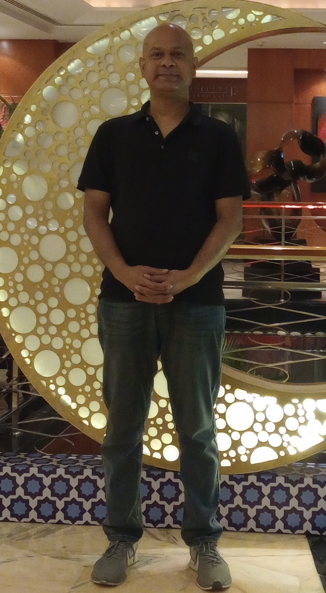

Eid Mubarak from Rashadul Islam ross!
রাশেদুল ইসলাম রস এর পক্ষ থেকে ঈদ মোবারক!

<details>
  <summary>Eid Greeting: Eid-ul-Fitre 2024</summary>
  

<details>
<summary>GREETINGS</summary>
  
  ```
  Happy to see your presence here!
  ```
  
<details>
        <summary>[ B ] 
        Rashadul Islam ross</summary>

  ```
  Brief:
  ```
 <details> <summary>[ B1 ] Let’s Introduce Me</summary>

   * B.Sc. in Computer Science, System & Software Computation System, Canada
   * B.Sc. in Computer Engineering, Software Engineering, Bangladesh
</details>

 <details> <summary>[ B2 ] Engagement</summary>

   + Full Stack DevOP ( Software )
   + Enterprise Design and Business Development
   + Enterprise Ready Software And System Architect
   + Liaison & Fundraiser for charity
   + Fedora: Open Source Community Ambassador
   + Data Analyst & Interpreter: Artificial Intelligence and Machine Learning
   + Algorithm Design and Development
   + Op-Ed: Technical Documentation, System Administration, Newsletter, Journal
   + Author: The Art of Artificial Intelligence & Computing System
   + Coach & Mentor: Industry 4.0 Leaders
   + Counselling SaaS, IaaS, PaaS
   + Community & Policy: Exploratory & explanatory speaker
</details>

   <details> <summary>[ B3 ] 
        Network contributions</summary>

  ```
  Connected network and affiliates:
  ```
     + IEEE
     + AIESEC
     + BSA
     + CFES
     + ENCS
     + RZS
     + CANT
     + IUB
     + ACADIA
     + CONCORDIA
     + LEGAL OFFICE 
     + PR, ADVERTISING AND MEDIA HOUSE
     + CHARTERED FIRMS
     + SCHOOLS
     + STEM COMMUNITY
     + IRON RING COMMUNITY
     + many more
</details>

<details>
        <summary> [ C ] Greeting</summary>

  ```
  English v0.01:
  ```
   > Let your perceptions lead you to where the future is realized through your understanding. A very happy and warm Eid wishes to you, your friends and family both at home and abroad!
  
  ```
  Bengla v0.01:
  ```

   > আপনার উপলব্ধিগুলি আপনাকে সেই দিকে নিয়ে যেতে দিন যেখানে আপনার বোঝার মাধ্যমে ভবিষ্যত উপলব্ধি করা হয়। দেশে এবং বিদেশে আপনাকে, আপনার বন্ধুবান্ধব এবং পরিবারকে একটি খুব খুশি এবং উষ্ণ ঈদের শুভেচ্ছা!

  ```
  French v0.01 :
  ```

   > Laissez vos perceptions vous conduire là où l’avenir se réalise grâce à votre compréhension. Un Aïd très joyeux et chaleureux vous souhaite, ainsi qu'à vos amis et votre famille, au pays et à l'étranger !

   </details>

<details>
        <summary> [ D ] Those who miss me: an image of mine says the gist</summary>

  ```
  How am i looking now, what's new?
  ```

   

   </details>

 <details>
   <summary> [ E ] How to reach</summary>

  ```
  Current Availability
  ```

   | Title      | Location |  Availability     |
   | :---        |    :----:   |          ---: |
   | Webex      | Gmail: rashadul.cse       | Video Conferencing   |
   | Postbox      | Outlook: itsme.rashadul       | Email   |
   | SMS/Page  | +HH0 AHDA GO ROSS        |  Send sms      |
   | Cell  | +HH0 AGA DAA HCIE        |  24x7      |
   | Venue  | BE.7376062, HI.2598786        |  You're invited & encouraged to attend      |

 </details>
</details>

```
Again, Eid Mubarak & Thank you!
```
</details>
